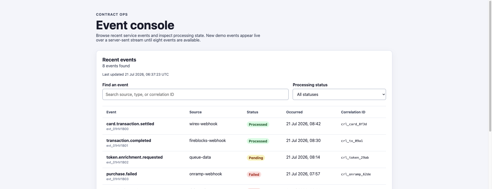
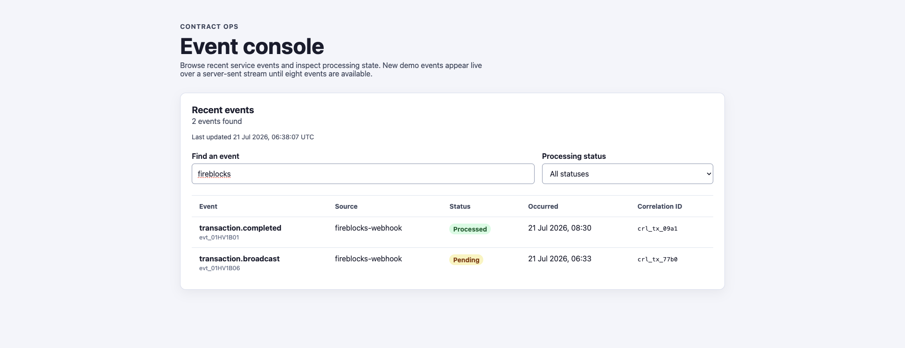
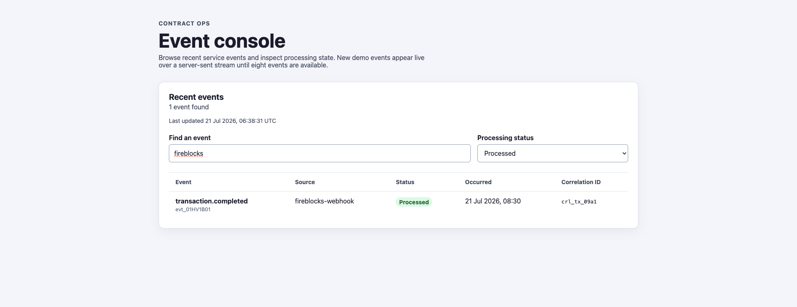
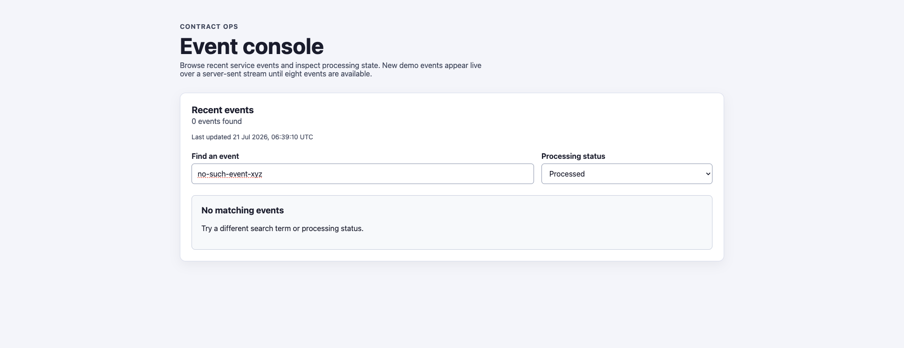

# Contract Ops

Portfolio project that showcases how I design a typed web front end against a small Go back-end service with a clear REST (and streaming) contract.

It is intentionally narrow so the important decisions stay visible: TypeScript boundaries, accessible UI states, OpenAPI-documented filtering, deterministic fixtures, Server-Sent Events for live updates, tests, and CI.

## What this repository demonstrates

This repo is for showcasing practical skills relevant to modern web engineering teams that work with **React**, **TypeScript**, **REST APIs**, and occasional **Go** services:

| Skill area | Where it shows up here |
|---|---|
| React + TypeScript | Strict TS UI, feature/app/api layering, deferred filter updates, EventSource lifecycle |
| CSS + accessibility | Native labelled controls, visible focus, live region status text, keyboard-operable filters, responsive table scroll |
| REST API design | `GET /v1/events` with validated query params, typed `EventPage` responses, OpenAPI 3.1 contract |
| Go service basics | Stdlib HTTP server, in-memory store, filtering, graceful shutdown, focused package tests |
| Event-style integration | Live demo generator + `GET /v1/events/stream` (SSE) pushing filtered pages as the store changes |
| Maintainability | Small packages, explicit loading/empty/error/retry states, runtime response validation, CI |
| Reliability habits | Deterministic fixtures, abort/cleanup on stream reconnect, mutex-safe store, signal-based shutdown |

It is **not** a production platform. There is no database, authentication, pagination broker, or multi-service deployment. The point is a reviewable slice of front-end / API / contract engineering.

## Screenshots

### Event list (live SSE feed)



### Search filter



### Status filter



### Empty state



## Architecture

```text
src/
  api/              Stream URL helpers and runtime response validation
  domain/           Shared frontend types
  features/         Event filter and table UI
  app/              Page composition and EventSource lifecycle
api/
  cmd/server/       Process entry point and graceful shutdown
  internal/events/  Model, fixtures, live generator, filtering, pub/sub
  internal/httpapi/ HTTP routing, SSE, CORS, JSON responses
openapi.yaml        Public API contract
```

```text
UI filters change
      |
      v
EventSource → GET /v1/events/stream?q&status
      |
      v
Go validates status → filtered EventPage snapshot
      |
      +---- generator appends a fixture every 5s until 8 events
      |
      v
SSE push → runtime validation → table + last-updated timestamp
```

The frontend owns interaction state. The API owns filtering and response shape. Fixtures start at four events; the process appends up to four more live demo events so reviewers can watch the console update without a refresh.

## Run locally

Requirements: Node.js 18+, npm, and Go 1.26+.

```bash
npm install
cd api && go test ./... && go run ./cmd/server
```

In another terminal:

```bash
npm run dev
```

Open `http://localhost:5173`. Leave the page open to watch the list grow from 4 to 8 events.

## Verify

```bash
npm run check
cd api && go test ./...
```

## API

`GET /v1/events` and `GET /v1/events/stream` accept:

| Parameter | Meaning |
|---|---|
| `q` | Case-insensitive match against event ID, source, type, or correlation ID |
| `status` | `processed`, `pending`, `failed`, or `all` |

The stream responds with `text/event-stream` messages whose `data` field is an `EventPage` JSON object.

Full contract: [`openapi.yaml`](./openapi.yaml)

Walkthrough: [`docs/demo-script.md`](./docs/demo-script.md)  
Design notes: [`docs/architecture.md`](./docs/architecture.md)

## Scope and tradeoffs

Omitted on purpose: persistence, auth, multi-tenant CORS, rate limiting, tracing, and a real event bus. The live generator is demo behaviour over an in-memory store so the contract and UI states stay easy to explain in an interview.

## Licence

MIT — see [`LICENSE`](./LICENSE).
